# 🧬 TopologySkinCancer
### Topology-Guided Explainable Deep Learning for Skin Cancer Classification

> **A dual-evidence framework for dermoscopic image classification — visual representation learning + lesion topology + post-hoc explanations.**

TopologySkinCancer is an end-to-end research prototype for **benign vs malignant skin-lesion classification**. Instead of relying only on appearance, the system explicitly models the **geometry and topology of the segmented lesion** and fuses those descriptors with deep visual features.

The project combines:

**Dermoscopic image → U-Net lesion segmentation → Persistent Homology / shape analysis → Deep visual backbone → learned fusion → benign/malignant prediction → Grad-CAM + SHAP explanations**

---

## ✨ Why this project is different

Most skin-lesion classifiers answer:

> **“What does the lesion look like?”**

This project asks two complementary questions:

> **“What does the lesion look like?”**  
> **“What is the mathematical structure of its boundary and shape?”**

The model therefore has two evidence streams:

| Evidence stream | What it captures |
|---|---|
| 🧠 Deep visual features | Texture, color, local patterns and high-level visual semantics |
| 🧬 Topological / geometric features | Connectivity, holes, circularity, compactness, convexity, fractal behaviour and boundary complexity |
| 🔍 Grad-CAM | Where the visual backbone is looking |
| 📊 SHAP | How the named topological features influence the prediction |

This makes the system more than a conventional image classifier: it is an **explainable topology-guided hybrid classifier**.

---

## 🏗️ Architecture

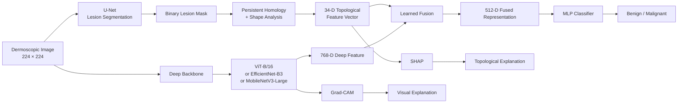

---

# 🧬 Topological Feature Engineering

The lesion mask is not treated merely as a preprocessing artifact.

It becomes a mathematical object from which a fixed-length representation is constructed.

### 34-dimensional topology vector

\[
\mathbf{z}_{topo}\in\mathbb{R}^{34}
\]

It is composed of:

| Component | Dimensions | Description |
|---|---:|---|
| Betti numbers | 2 | \( \beta_0 \), \( \beta_1 \) |
| Shape descriptors | 5 | Circularity, compactness, convexity, fractal dimension, boundary complexity |
| Persistence image | 25 | Flattened \(5\times5\) H1 persistence image |
| Persistence landscape statistics | 2 | Mean and maximum |
| **Total** | **34** | Fixed-length topology representation |

### Named descriptors

- **Betti-0** — connected components
- **Betti-1** — holes / one-dimensional topological structure
- **Circularity** — boundary regularity relative to a circle
- **Compactness** — area/perimeter-based shape concentration
- **Convexity** — deviation from the convex hull
- **Fractal dimension** — complexity of the lesion boundary
- **Boundary complexity** — irregularity of the contour

The persistence module uses a normalized lesion-boundary point cloud and computes persistent homology with **Ripser**, followed by persistence-image and landscape representations.

---

# 🔀 Learned Fusion

The default architecture uses **gated fusion**.

The deep and topology streams are projected into the same hidden space:

\[
h_d = f_d(x),\qquad h_t=f_t(z)
\]

A learned sigmoid gate determines how much each stream contributes:

\[
g=\sigma(W[h_d;h_t])
\]

and

\[
h_{fused}=g\odot h_d+(1-g)\odot h_t.
\]

This is useful because the quality of the segmentation mask can vary between lesions. The model can therefore learn to rely more heavily on visual evidence or topology depending on the sample.

An alternative **attention-based fusion** implementation is also included.

---

# 🧠 Supported Backbones

The same topology/fusion/classification pipeline can be evaluated with three visual backbones:

| Backbone | Role |
|---|---|
| **ViT-B/16** | Global visual representation |
| **EfficientNet-B3** | CNN-based high-capacity representation |
| **MobileNetV3-Large** | Lightweight CNN / deployment-oriented comparison |

This makes the backbone comparison controlled: the topology branch and classifier design remain shared.

---

# 📊 Experimental Results

The repository contains multiple training configurations and evaluation outputs.

Metrics below are read directly from the saved experiment JSON files.

## HAM10000 held-out test set

| Configuration | Accuracy | Precision | Recall | F1 | F2 | ROC-AUC |
|---|---:|---:|---:|---:|---:|---:|
| ViT-B/16 | 78.88% | 47.01% | 85.03% | 60.54% | 73.19% | 0.9059 |
| ViT-B/16 Partial-1 | **84.47%** | **56.28%** | 82.80% | **67.01%** | 75.67% | **0.9199** |
| ViT-B/16 Partial-2 | 81.37% | 50.66% | 85.67% | 63.67% | 75.27% | 0.9129 |
| ViT-B/16 Partial-3 | 83.68% | 54.86% | 80.89% | 65.38% | 73.88% | 0.9140 |
| ViT-B/16 Partial-4 | 80.76% | 49.72% | 84.08% | 62.49% | 73.87% | 0.9084 |
| EfficientNet-B3 | 74.58% | 41.86% | **85.99%** | 56.31% | 71.02% | 0.8716 |
| EfficientNet-B3 Partial-2 | 80.76% | 49.72% | 83.44% | 62.31% | 73.47% | 0.9037 |
| EfficientNet-B3 Partial-4 | 83.31% | 53.92% | 85.35% | 66.09% | **76.44%** | 0.9167 |
| EfficientNet-B3 Partial-6 | 83.68% | 54.68% | 83.76% | 66.16% | 75.71% | 0.9151 |
| MobileNetV3 | 76.88% | 44.39% | 84.39% | 58.18% | 71.51% | 0.8844 |
| MobileNetV3 Partial-2 | 82.40% | 52.51% | 79.94% | 63.38% | 72.38% | 0.9083 |
| MobileNetV3 Partial-4 | 84.28% | 56.12% | 80.25% | 66.06% | 73.90% | 0.9163 |
| MobileNetV3 Partial-6 | 82.46% | 52.52% | 83.12% | 64.36% | 74.44% | 0.9041 |

### Best HAM10000 observations

- **Best Accuracy:** ViT-B/16 Partial-1 — **84.47%**
- **Best Precision:** ViT-B/16 Partial-1 — **56.28%**
- **Best Recall:** EfficientNet-B3 — **85.99%**
- **Best F1:** ViT-B/16 Partial-1 — **67.01%**
- **Best F2:** EfficientNet-B3 Partial-4 — **76.44%**
- **Best ROC-AUC:** ViT-B/16 Partial-1 — **0.9199**

The ViT Partial-1 configuration provides the strongest overall combination of discrimination and F1 on this held-out HAM10000 evaluation.

### ViT Partial-1 confusion matrix

```text
                 Predicted
               Benign  Malignant
Actual Benign    1132      202
Actual Malignant   54      260
```

Derived from the saved confusion matrix:

- Sensitivity / Recall: **82.80%**
- Specificity: **84.86%**
- Balanced Accuracy: **83.83%**

---

# 🌍 PH2 External Evaluation

PH2 is evaluated separately as an external dataset in the saved experiment outputs.

| Configuration | Accuracy | Precision | Recall | F1 | F2 | ROC-AUC |
|---|---:|---:|---:|---:|---:|---:|
| ViT-B/16 Frozen | 85.00% | 60.87% | 70.00% | 65.12% | 67.96% | 0.8978 |
| ViT-B/16 Partial-1 | 87.00% | 64.58% | 77.50% | 70.45% | 74.52% | 0.9044 |
| ViT-B/16 Partial-2 | 88.00% | 64.29% | **90.00%** | **75.00%** | **83.33%** | **0.9383** |
| ViT-B/16 Partial-3 | 88.50% | 68.09% | 80.00% | 73.56% | 77.29% | 0.9155 |
| ViT-B/16 Partial-4 | **89.00%** | 68.75% | 82.50% | **75.00%** | 79.33% | 0.9244 |
| EfficientNet-B3 Frozen | 78.50% | 47.27% | 65.00% | 54.74% | 60.47% | 0.8169 |
| EfficientNet-B3 Partial-2 | 86.00% | 65.79% | 62.50% | 64.10% | 63.13% | 0.7966 |
| EfficientNet-B3 Partial-4 | 86.00% | **73.08%** | 47.50% | 57.58% | 51.08% | 0.8413 |
| MobileNetV3 Frozen | 65.50% | 30.67% | 57.50% | 40.00% | 48.94% | 0.7014 |
| MobileNetV3 Partial-2 | 78.50% | 47.06% | 60.00% | 52.75% | 56.87% | 0.8053 |
| MobileNetV3 Partial-4 | 82.50% | 56.10% | 57.50% | 56.79% | 57.21% | 0.8367 |

### Best PH2 observations

- **Best Accuracy:** ViT-B/16 Partial-4 — **89.00%**
- **Best Precision:** EfficientNet-B3 Partial-4 — **73.08%**
- **Best Recall:** ViT-B/16 Partial-2 — **90.00%**
- **Best F1:** 75.00% — ViT Partial-2 / Partial-4
- **Best F2:** ViT-B/16 Partial-2 — **83.33%**
- **Best ROC-AUC:** ViT-B/16 Partial-2 — **0.9383**

### ViT Partial-2 PH2 confusion matrix

```text
                 Predicted
               Benign  Malignant
Actual Benign     140       20
Actual Malignant    4       36
```

Derived:

- Sensitivity / Recall: **90.00%**
- Specificity: **87.50%**
- Balanced Accuracy: **88.75%**

---

# 🔬 What the results suggest

The experiments reveal an important pattern:

### 1. Partial fine-tuning is a useful middle ground

The ViT-B/16 has approximately **86.9M total parameters** in the training logs. Full fine-tuning can adapt strongly but is more vulnerable to overfitting on a relatively small medical dataset.

Partial fine-tuning allows the pretrained representation to remain largely intact while adapting selected late blocks.

### 2. Recall and precision trade off sharply

A high recall configuration can identify more malignant samples but may also increase false positives.

This is visible in the experiments:

- EfficientNet-B3 reaches **85.99% recall** on HAM10000.
- ViT Partial-1 provides a better precision/F1 balance.
- On PH2, ViT Partial-2 reaches **90% recall** with **0.9383 ROC-AUC**.

### 3. External evaluation is especially informative

The PH2 experiments provide a separate view of generalization rather than relying only on the internal HAM10000 split.

---

# 🔍 Explainability

The inference pipeline produces four complementary artifacts:

```text
prediction.json
       │
       ├── predicted class
       ├── confidence
       ├── class probabilities
       ├── Betti numbers
       └── shape descriptors

lesion_mask.png
       └── U-Net segmentation

gradcam_heatmap.png
       └── visual evidence / model attention

shap_report.txt
       └── topological feature contributions
```

---

# 🔥 Grad-CAM + Lesion Mask Examples

The following examples are from the saved **EfficientNet-B3 Partial-2** qualitative inference outputs.

## Example A — malignant prediction

**ISIC_0028412**

Prediction:

- **Class:** malignant
- **Confidence:** **98.50%**
- \(P(\text{benign}) = 1.50\%\)
- \(P(\text{malignant}) = 98.50\%\)
- \(\beta_0=1,\ \beta_1=0\)

### Grad-CAM

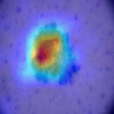

### Lesion mask

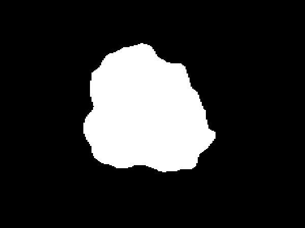

**Shape descriptors**

| Feature | Value |
|---|---:|
| Circularity | 0.7355 |
| Compactness | 0.0585 |
| Convexity | 0.9460 |
| Fractal dimension | 0.9566 |
| Boundary complexity | 1.0838 |

An interesting explainability result is that the supplied SHAP values for the named topology features are all slightly **negative toward the malignant class**, despite the final prediction being strongly malignant. This indicates that, for this sample, the topological branch itself was not the main positive driver of the malignant decision; the visual/deep representation and learned fusion can dominate the final output.

---

## Example B — benign prediction

**ISIC_0030623**

Prediction:

- **Class:** benign
- **Confidence:** **62.94%**
- \(P(\text{benign}) = 62.94\%\)
- \(P(\text{malignant}) = 37.06\%\)
- \(\beta_0=1,\ \beta_1=0\)

### Grad-CAM

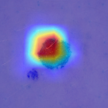

### Lesion mask

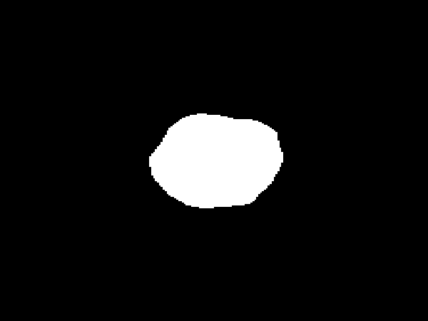

**Shape descriptors**

| Feature | Value |
|---|---:|
| Circularity | 0.8605 |
| Compactness | 0.0685 |
| Convexity | 0.9781 |
| Fractal dimension | 0.9990 |
| Boundary complexity | 1.0530 |

For this sample, the supplied SHAP report shows positive contributions toward malignant risk for the named topology features, while the final classifier still predicts benign. This is a useful demonstration of why the model should be interpreted as a **multi-source evidence system**, rather than assuming that one explanation modality completely determines the prediction.

---


# 🧪 Qualitative Test Gallery — EfficientNet-B3

The following qualitative results are generated using the **EfficientNet-B3 Partial-2** configuration. Each case contains:

- 🔥 Grad-CAM heatmap
- 🎭 U-Net lesion mask
- 📊 Prediction probabilities
- 🧬 Topological descriptors
- 🔍 SHAP feature contributions

## EfficientNet-B3 Partial-2 Predictions

| Image ID | Prediction | Confidence | Malignant Probability |
|---|---|---:|---:|
| ISIC_0029811 | 🔴 malignant | **98.98%** | **98.98%** |
| ISIC_0031072 | 🟢 benign | **91.85%** | 8.15% |
| ISIC_0032166 | 🟢 benign | 86.50% | 13.50% |
| ISIC_0032976 | 🔴 malignant | 94.27% | 94.27% |
| ISIC_0034128 | 🟢 benign | 69.52% | 30.48% |

---

## 🔥 Grad-CAM + 🎭 Lesion Mask Gallery

### ISIC_0029811 — Malignant · 98.98%

<table>
<tr>
<td><b>Grad-CAM</b></td>
<td><b>Lesion Mask</b></td>
</tr>
<tr>
<td>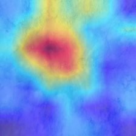</td>
<td></td>
</tr>
</table>

### ISIC_0031072 — Benign · 91.85%

<table>
<tr>
<td><b>Grad-CAM</b></td>
<td><b>Lesion Mask</b></td>
</tr>
<tr>
<td>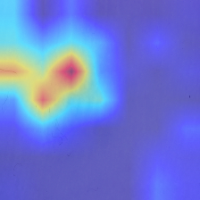</td>
<td>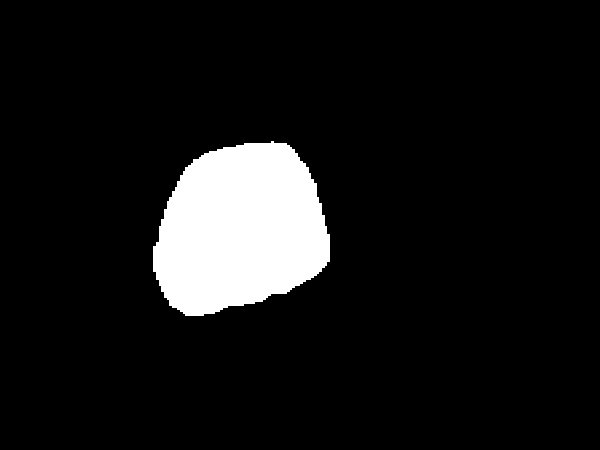</td>
</tr>
</table>

### ISIC_0032166 — Benign · 86.50%

<table>
<tr>
<td><b>Grad-CAM</b></td>
<td><b>Lesion Mask</b></td>
</tr>
<tr>
<td>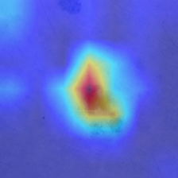</td>
<td>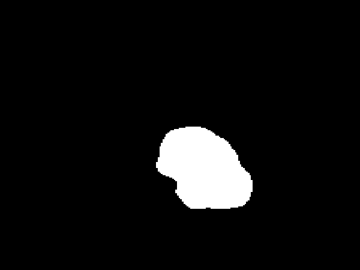</td>
</tr>
</table>

### ISIC_0032976 — Malignant · 94.27%

<table>
<tr>
<td><b>Grad-CAM</b></td>
<td><b>Lesion Mask</b></td>
</tr>
<tr>
<td>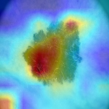</td>
<td>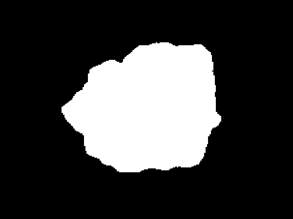</td>
</tr>
</table>

### ISIC_0034128 — Benign · 69.52%

<table>
<tr>
<td><b>Grad-CAM</b></td>
<td><b>Lesion Mask</b></td>
</tr>
<tr>
<td>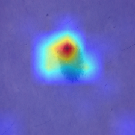</td>
<td>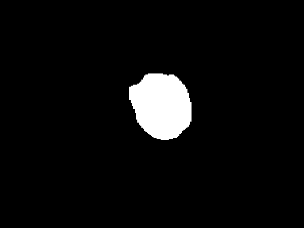</td>
</tr>
</table>

---

## 🧬 Topological Evidence

The EfficientNet-B3 qualitative outputs also contain the extracted topological descriptors and SHAP explanations.

For example, **ISIC_0024679** was predicted malignant with **84.02% confidence**. Its lesion had:

```text
β₀ = 2
β₁ = 0

Circularity          = 0.6738
Compactness          = 0.0536
Convexity            = 0.9182
Fractal Dimension    = 1.0592
Boundary Complexity  = 1.1133

> The repository also contains corresponding qualitative folders for EfficientNet-B3 Partial-2 and MobileNetV3 Partial-2.

---

# 📁 Repository Structure

```text
TopologySkinCancer/
│
├── backbone/
│   ├── vit.py
│   ├── efficientnet.py
│   ├── mobilenet.py
│   └── cnn_backbone.py
│
├── data/
│   ├── datasets.py
│   └── topo_wrapper.py
│
├── datasets/
│   └── README.md
│
├── explainability/
│   ├── gradcam.py
│   └── shap_explain.py
│
├── fusion/
│   ├── gated_fusion.py
│   └── attention_fusion.py
│
├── models/
│   └── hybrid_model.py
│
├── segmentation/
│   ├── unet.py
│   ├── train_unet.py
│   └── predict_masks.py
│
├── topology/
│   ├── gudhi_features.py
│   ├── persistence.py
│   └── extract.py
│
├── utils/
│   ├── common.py
│   ├── transforms.py
│   └── metrics.py
│
├── checkpoints/
│
├── outputs/
│   ├── *_results.json
│   ├── qualitative_*/
│   └── final_example_prediction_*/
│
├── config.py
├── train.py
├── evaluate.py
├── inference.py
├── download_data.sh
└── requirements.txt
```

---

# ⚙️ Installation

```bash
git clone <YOUR_GITHUB_REPOSITORY_URL>
cd TopologySkinCancer

python3 -m venv venv
source venv/bin/activate

# Install a PyTorch build compatible with your CUDA installation first.
pip install -r requirements.txt
```

The original project targets GPU execution and was designed/tested around an **RTX A4500-class 20 GB GPU**.

---

# 🧩 Dataset Preparation

The implementation supports:

- **HAM10000** — binary benign/malignant classification
- **ISIC2018 Task 1** — U-Net segmentation training
- **PH2** — external evaluation

HAM10000 uses the binary mapping implemented in `config.py`:

```text
Malignant:
    mel, bcc, akiec

Benign:
    nv, bkl, df, vasc
```

The classification split is lesion-grouped to reduce leakage from multiple images belonging to the same physical lesion.

The recorded training run used:

```text
Total HAM10000 samples: 10015
Train: 6677
Validation: 1690
Test: 1648
```

The split ratios are approximate because grouping by `lesion_id` constrains which samples can be placed together.

---

# 🚀 Training

### ViT-B/16

```bash
python train.py \
    --backbone vit_b16 \
    --fusion gated \
    --epochs 50 \
    --dropout 0.5 \
    --unfreeze-last-n-blocks 1 \
    --early-stopping-patience 8
```

### EfficientNet-B3

```bash
python train.py \
    --backbone efficientnet_b3 \
    --fusion gated \
    --epochs 40
```

### MobileNetV3

```bash
python train.py \
    --backbone mobilenet_v3 \
    --fusion gated \
    --epochs 40
```

### Fully frozen backbone

```bash
python train.py \
    --backbone vit_b16 \
    --fusion gated \
    --freeze-backbone
```

---

# 🧪 Evaluation

```bash
python evaluate.py \
    --checkpoint checkpoints/hybrid_model_best.pth \
    --dataset ham10000 \
    --output-json outputs/results.json
```

For PH2:

```bash
python evaluate.py \
    --checkpoint checkpoints/hybrid_model_best.pth \
    --dataset ph2 \
    --output-json outputs/ph2_results.json
```

Threshold sweeping is supported:

```bash
python evaluate.py \
    --checkpoint checkpoints/hybrid_model_best.pth \
    --dataset ham10000 \
    --sweep-thresholds
```

---

# 🔬 Single-Image Explainable Inference

```bash
python inference.py \
    --image path/to/lesion.jpg \
    --checkpoint checkpoints/hybrid_model_best.pth \
    --unet-checkpoint checkpoints/unet_segmentation_best.pth \
    --output-dir outputs/my_prediction
```

The output directory contains:

```text
my_prediction/
├── prediction.json
├── lesion_mask.png
├── gradcam_heatmap.png
└── shap_report.txt
```

---

# 🧠 Interpretation of the Explainability Stack

### Grad-CAM

Grad-CAM answers:

> **Where did the visual network look?**

The heatmap is generated from the selected target class and overlaid on the dermoscopic image.

### Lesion Mask

The U-Net mask answers:

> **Which region was considered the lesion?**

This mask also becomes the input to the topology pipeline.

### SHAP

SHAP answers:

> **Which named topological features pushed the prediction toward or away from malignancy?**

The current implementation explains:

```text
betti_0
betti_1
circularity
compactness
convexity
fractal_dimension
boundary_complexity
```

---

# 🧪 Reproducibility

Important configuration values include:

```text
Seed                 = 42
Image size           = 224 × 224
Batch size           = 32
Learning rate        = 3e-5
Weight decay         = 1e-4
Warmup epochs        = 2
Label smoothing      = 0.05
Gradient clipping    = 1.0
Fusion hidden dim    = 512
Topology dimension   = 34
```

The training implementation also supports:

- class-weighted loss
- weighted sampling
- F1 / F2 / recall / ROC-AUC / accuracy checkpoint selection
- early stopping
- complete checkpoint saving
- lesion-grouped splitting

---

# 📈 Key Takeaways

### 🥇 Strongest HAM10000 overall balance

**ViT-B/16 Partial-1**

```text
Accuracy   84.47%
Precision  56.28%
Recall     82.80%
F1         67.01%
F2         75.67%
ROC-AUC    0.9199
```

### 🥇 Strongest PH2 discrimination

**ViT-B/16 Partial-2**

```text
Accuracy   88.00%
Precision  64.29%
Recall     90.00%
F1         75.00%
F2         83.33%
ROC-AUC    0.9383
```

### 🎯 Highest PH2 accuracy

**ViT-B/16 Partial-4 — 89.00%**

### 🧬 Highest HAM10000 recall

**EfficientNet-B3 — 85.99%**

### ⚖️ Highest HAM10000 F2

**EfficientNet-B3 Partial-4 — 76.44%**

---

# ⚠️ Research Disclaimer

This repository is a **research/academic prototype**.

The predictions and explanation maps are not a substitute for dermatologist assessment, histopathology, or clinical diagnosis. The reported metrics depend on the selected datasets, preprocessing, split strategy, checkpoint and decision threshold.

In particular, accuracy alone should not be used to judge a screening model on an imbalanced medical dataset. Recall, specificity, ROC-AUC, F1/F2 and external validation should be considered together.

---

# 📚 Citation

If you use this implementation in a report, dissertation or research project, cite the repository and describe the exact experimental configuration used.

```bibtex
@software{topologyskincancer,
  title  = {TopologySkinCancer: Topology-Guided Explainable Deep Learning for Skin Cancer Classification},
  author = {Manas Mondal},
  year   = {2026},
  note   = {Research prototype for topology-guided dermoscopic image classification}
}
```

---

# ⭐ Project Idea in One Sentence

> **TopologySkinCancer treats a skin lesion as both an image and a mathematical shape, allowing visual deep learning and persistent topology to jointly explain the final cancer classification.**

